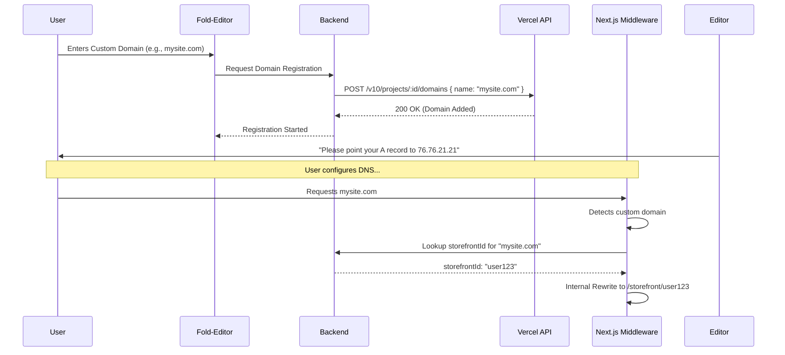

# Custom Domain Automation Guide (Vercel API)

This document outlines the architecture, pricing, and action plan for automating custom domain registration using the Vercel API.

## 💰 Pricing Analysis

Vercel's pricing for custom domains is based on **project limits**, not a per-domain fee.

| Plan | Domain Limit | SSL Cost | API Access |
| :--- | :--- | :--- | :--- |
| **Hobby (Free)** | 50 domains / project | $0 (Free) | ✅ Yes |
| **Pro ($20/user)** | 250 domains / project* | $0 (Free) | ✅ Yes |
| **Enterprise** | Unlimited | $0 (Free) | ✅ Yes |

*\* Pro plan limits can be increased upon request. Vercel does not charge extra for adding domains via API.*

---

## 🏗️ Architecture Flow

The following diagram illustrates how a custom domain is automatically registered and routed.



---

## 🚀 Action Plan for Testing

Follow these steps to test the automation:

### 1. Preparation
-   Generate a **Vercel Access Token** in your [Vercel Settings](https://vercel.com/account/tokens).
-   Get your **Project ID** from the Project Settings dashboard.
-   Add these to your `.env.local`:
    ```env
    VERCEL_TOKEN=your_token_here
    VERCEL_PROJECT_ID=your_project_id
    VERCEL_TEAM_ID= (optional)
    ```

### 2. Implementation Check
-   Ensure `services/vercel.ts` is correctly implemented.
-   Create a test script or temporary API route to trigger `addCustomDomainToVercel('test-domain.com')`.

### 3. Verification Sequence
1.  **Trigger API**: Call the function with a domain you own.
2.  **Dashboard Check**: Confirm the domain appears in **Vercel Project Settings > Domains**.
3.  **Verification**: Call `verifyCustomDomainStatus()` to see the required DNS records (Vercel will return the A/CNAME values needed).
4.  **Middleware Test**: (Advanced) Once DNS is pointed, visit the domain and ensure your `proxy.ts` correctly identifies it.

---

## 🛠️ How to Automate in Code

You can integrate this directly into your Storefront settings page:

```typescript
// Example frontend handler
async function handleAddDomain() {
  const domain = "client-site.com";
  
  // 1. Save to your DB (so middleware knows which storefront it belongs to)
  await updateStorefrontSettings(storefrontId, { customDomain: domain });
  
  // 2. Add to Vercel via your API
  const result = await fetch('/api/admin/domains/add', {
    method: 'POST',
    body: JSON.stringify({ domain })
  });
  
  if (result.ok) {
    alert("Domain added! Please point your DNS to Vercel.");
  }
}
```

> [!WARNING]
> Always validate domain formats on the backend before calling the Vercel API to prevent injection or invalid requests.
