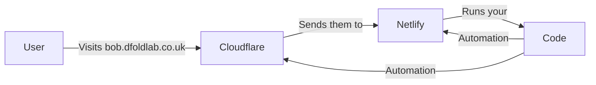

# 🍎 Domains & Subdomains: The "ELI5" Guide

This guide explains how your website's addresses work, using a simple analogy.

---

## 1. The Three Layers (The Analogy)

Imagine you are building a chain of lemonade stands.

### 🏠 The House (Netlify)
This is where your website lives. It has the walls, the roof, and the lemonade recipe (your code).
*   **Technical URL**: `storefronte.netlify.app`

### ☎️ The Phone Book (Cloudflare)
This is the person people call to find out where your "House" is. When someone dials `dfoldlab.co.uk`, Cloudflare says: *"Go to the Netlify House!"*

### 🏪 The Registration (Namecheap)
This is the shop where you "bought" your name (`dfoldlab.co.uk`). You told Namecheap: *"Cloudflare is my manager. If anyone asks about my name, talk to them."*

---

## 2. How a New Shop is Made (The Magic)

When a new user creates a shop called **"Bob"**:

1.  **The Brain (Code)** talks to **Cloudflare**: *"Hey, add a new name: `bob.dfoldlab.co.uk` and tell people it's at the Netlify House."*
2.  **The Brain (Code)** talks to **Netlify**: *"Hey, a new guest named `bob.dfoldlab.co.uk` is coming. Let them in and give them an SSL key (Security Badge)."*
3.  **The User** visits `bob.dfoldlab.co.uk` and it works!

---

## 3. Switching to a New House (Migration Flow)

If you decide to move from **Netlify** to **Vercel** (or any other house):

### Step A: Prepare the New House
1.  Upload your code to the new house.
2.  Get the new "Address" (Usually a CNAME record from the new provider).

### Step B: Tell the Manager (Cloudflare)
1.  Go to Cloudflare.
2.  Find the `@`, `www`, and `*` records.
3.  Change the "Target" from `storefronte.netlify.app` to your **New Address**.

### Step C: Update the Brain (Code)
1.  Update the **Environment Variables** in the new house.
2.  You will need new **API Keys** for the new house so the Brain can talk to it.

---

## 4. What to Configure Where

| Component | What to Configure | Why? |
| :--- | :--- | :--- |
| **Namecheap** | Nameservers | Points everything to Cloudflare once and for all. |
| **Cloudflare** | DNS Records (`@`, `www`, `*`) | Tells the world where your "House" is. |
| **Netlify** | Domain Aliases | Lets specific names into your house. (Code does this for you now!) |
| **Code (.env)** | API Tokens | The "Secret Passwords" the code uses to talk to Cloudflare and Netlify. |

---

## 5. Summary of the Flow

